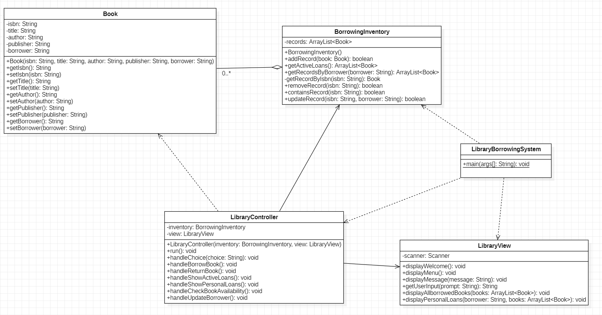

# 📚 Library Borrowing System

A console-based Java application.

---

## 📌 Assumptions
- The library is assumed to have **every book available** — the system does not maintain a catalogue of all books
- The system only stores and manages **active borrowing records** — it does not track the full book inventory
- Books must be borrowed **individually**, one at a time
- Any book that is not already checked out is considered **available to borrow**
- The library holds a **single copy** of each title
- Books must be returned **individually**, one at a time
- Books can be returned at **any time** with no minimum or maximum loan duration
- Each book has a **unique ISBN** used as its identifier

---

## 💾 System Requirements
The system manages the following **Book** information:

| Field | Type | Description |
|---|---|---|
| `isbn` | `String` | Unique identifier per book |
| `title` | `String` | Title of the book |
| `author` | `String` | Author of the book |
| `publisher` | `String` | Publisher of the book |
| `borrower` | `String` | Name of the person borrowing |

---

## ✨ Features
- **Borrow a book** — record a new borrowing entry
- **Display all borrowed books** — view all active borrowing records in a formatted table
- **Return a book** — remove a borrowing record when a book is returned
- **View personal loans** — view all books borrowed by a specific borrower
- **Check book availability** — verify whether a book is available to borrow
- **Update a borrowing record** — update the borrower name on an existing record

---

## 📁 Project Structure
```
LibraryBorrowingSystem/
│
├── src/
│   ├── model/
│   │   ├── Book.java                  # Book model - stores borrowing record data
│   │   └── BorrowingInventory.java    # Manages all borrowing records
│   │
│   ├── controller/
│   │   └── LibraryController.java     # Coordinates flow between View and Model
│   │
│   ├── view/
│   │   └── LibraryView.java           # Handles all user input and output
│   │
│   └── LibraryBorrowingSystem.java    # Main entry point
│
└── README.md
```


## 📊 UML Class Diagram


---

## 🚀 Getting Started

### Prerequisites
- Java JDK 17 or higher
- Any Java IDE (VS Code, IntelliJ IDEA, Eclipse)

### Installation
1. Clone the repository
```bash
git clone https://github.com/charleneChen/LibraryBorrowingSystem.git
```

2. Navigate to the project directory
```bash
cd LibraryBorrowingSystem
```

3. Compile the source files
```bash
javac src/*.java
```

4. Run the application
```bash
java -cp src LibraryBorrowingSystem
```

---

## 💻 Usage
Once the application starts, the following menu will be displayed:
```
     ========================
      Library Borrowing System
     ========================

     1. Borrow a book
     2. Display all borrowed books
     3. Return a book / Delete a borrowing record
     4. View personal loans
     5. Check book availability
     6. Update borrower / Update a borrowing record
     0. Exit

     Enter choice:
```

---

## 🧪 Testing

| # | Scenario | Expected Result |
|---|---|---|
| 1 | Borrow a book | Record added successfully |
| 2 | Borrow same book twice | Error message displayed |
| 3 | Display all borrowed books | All records displayed |
| 4 | Return a borrowed book | Record removed successfully |
| 5 | Return a book not borrowed | Error message displayed |
| 6 | View personal loans with active loans | Loans filtered by borrower displayed |
| 7 | View personal loans with no loans | No loans message displayed |
| 8 | Check available book | Available message displayed |
| 9 | Check unavailable book | Not available message displayed |
| 10 | Update borrower on existing record | Record updated successfully |
| 11 | Update borrower on non-existing record | Error message displayed |

---

## 🛠️ Technologies Used
- **Java** JDK 17
- **MVC** Pattern
- **OOP** Principles — Encapsulation, Abstraction, Association

---

## 👨‍💻 Author
Developed by **Charlene(Xiaolian) Chen**

---

## 📄 License
This project is for educational purposes only.
